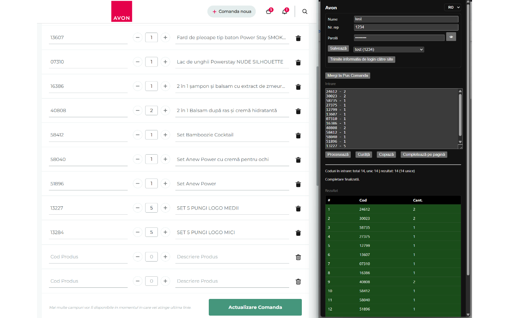

# Avon Auto Order Filler - Chrome Extension (MV3)

A sophisticated Chrome extension that automates the process of filling Avon Product Entry forms. The extension parses messy text input containing 5-digit product codes and quantities, then automatically fills the corresponding form fields on Avon's website.

## Features

- **Smart Product Code Parsing**: Extracts 5-digit product codes and quantities from various text formats
- **Automatic Form Filling**: Fills Avon Product Entry forms with parsed data
- **Batch Processing**: Handles large orders with batch size 30
- **Login Management**: Save and auto-fill login credentials for multiple accounts
- **Internationalization**: Full support for Romanian (RO) and English (EN) languages
- **Comprehensive Testing**: Extensive test coverage for order parsing logic
- **Modern Architecture**: Built with Manifest V3 and ES modules

## Screenshots



*The main popup interface showing order input, processing, and form filling capabilities*

## Installation

### Load Unpacked (Development)

1. Open Chrome and navigate to `chrome://extensions`
2. Enable Developer mode (toggle in top-right)
3. Click "Load unpacked" and select this folder: `/home/user/avon-extension`

## Usage

### Basic Workflow

1. **Click the extension icon** to open the popup interface
2. **Input Order Data**: Paste messy text containing product codes and quantities
   - Supports formats like: `2x11155 99911 77333x3`
   - Handles page numbers: `Pag15-14340`
   - Recognizes various quantity formats: `x2`, `-2`, `(2)`, `[2]`
3. **Process Input**: Click "Process" to parse and format the data
4. **Fill Forms**: Click "Fill On Page" to automatically populate Avon's Product Entry form
5. **Batch Processing**: For large orders, the extension processes items in batches with pause/resume functionality

### Login Management

- Save multiple login credentials with descriptive names
- Auto-fill login forms on Avon pages
- Secure local storage of credentials

### Language Support

- Toggle between Romanian (RO) and English (EN)
- All interface elements are properly localized

## Technical Details

### Architecture

- **Manifest V3**: Modern Chrome extension architecture
- **Service Worker**: Background script for extension lifecycle management
- **Content Scripts**: Page-specific functionality for Avon websites
- **ES Modules**: Modern JavaScript with `type: "module"`
- **Internationalization**: Chrome i18n API with fallback support

### File Structure

```
├── manifest.json          # Extension configuration
├── background.js          # Service worker
├── contentScript.js       # Page interaction logic
├── i18n.js               # Internationalization utilities
├── popup/                 # Extension popup interface
│   ├── popup.html        # Main popup UI
│   ├── popup.css         # Styling
│   ├── popup.js          # Popup functionality
│   └── utils.js          # Utility functions
├── _locales/             # Language files
│   ├── en/               # English translations
│   └── ro/               # Romanian translations
├── tests/                 # Test suite
│   └── extractItems.test.js
└── example_input.txt      # Sample order data
```

### Permissions

- `storage`: Save login credentials and preferences
- `activeTab`: Access current tab for form filling
- `scripting`: Inject scripts for page interaction
- `tabs`: Open Product Entry pages
- `host_permissions`: Limited to `https://*.avoncosmetics.ro/*`

### Testing

The extension includes comprehensive tests for the order parsing logic:

```bash
# Run tests (requires Node.js with ES module support)
node tests/extractItems.test.js
```

Tests cover various order formats, edge cases, and parsing scenarios to ensure reliable product code extraction.

## Development

### No Build Tools Required

This extension uses plain JavaScript, HTML, and CSS - no compilation or bundling needed.

### Adding New Languages

1. Create a new directory in `_locales/` (e.g., `_locales/de/`)
2. Add a `messages.json` file with translated strings
3. Update the language selector in `popup.html`

### Extending Functionality

- **New Order Formats**: Modify the regex patterns in `popup/utils.js`
- **Additional Features**: Extend the content script for new page interactions
- **UI Improvements**: Update popup HTML/CSS/JS as needed

## Notes

- **Security**: Login credentials are stored locally using Chrome's storage API
- **Performance**: Large orders are processed in batches to avoid overwhelming the page
- **Compatibility**: Designed specifically for Avon's Romanian website structure
- **Testing**: Comprehensive test suite ensures parsing reliability across various input formats

## License

This project is designed for personal use with Avon's ordering system.
